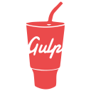

## Hello World, I'm Mohammed  👋

- ✍ You can find my projects here [portfolio]
- 🌱 I’m currently learning React.js
- 👀 I’m interested in cyber security specially pen-testing
- ⚡ Fun fact: i'm using linux :smiley:

<!-- 🔭 💬   -->

### Talk with me, I am kinda awesome

[][linkedin]
[][codepen]

<!--  -->

<!-- [website]: https://holistic-developer.com/ -->
[linkedin]: https://linkedin.com/in/mohammed-taysser
[portfolio]: https://mohammed-taysser.github.io/portfolio/
[telegram]: t.me/mohammedTaysser
[codepen]: https://codepen.io/mohmmedtaysser/

 

### Languages and Tools

<!--  -->

<!-- https://github.com/devicons/devicon/tree/master/icons -->

&nbsp;
&nbsp;
&nbsp;
&nbsp;
&nbsp;
&nbsp;
&nbsp;

&nbsp;
&nbsp;
&nbsp;
&nbsp;
&nbsp;
&nbsp;
&nbsp;
